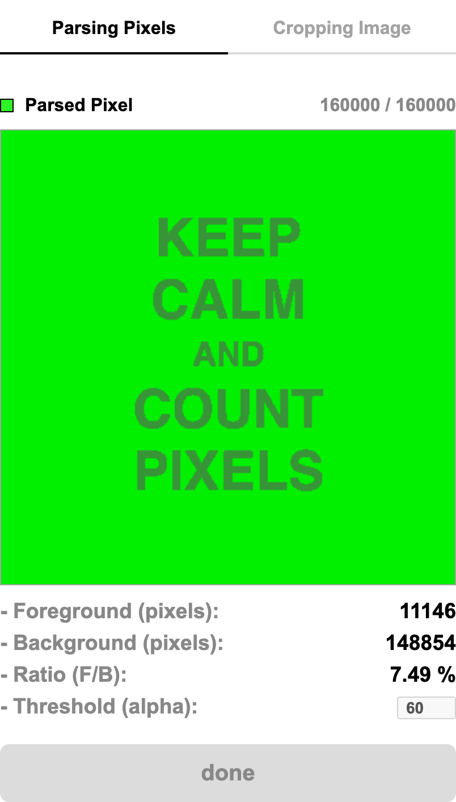
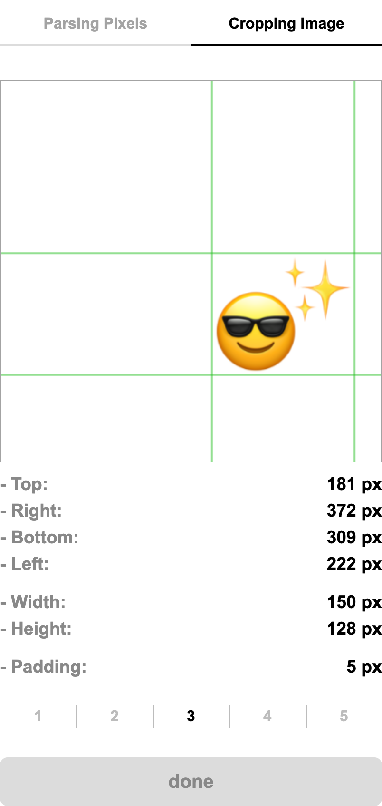

# Pixel Manipulation with Canvas API

With the `ImageData` object we can directly read and write a data array to manipulate pixel data.

This repository contains two small demos that work on the raw RGBA bytes returned by
`CanvasRenderingContext2D.getImageData()`. They were built while implementing a handwritten
signature module, where a signature drawn on a canvas had to be validated, cropped and resized
on the client before being sent to the server.

- Article (Korean): [Canvas API를 이용한 노란우산공제 가입서비스 자필 서명 이미지 생성 모듈 구현기](https://blog.wonkooklee.com/docs/service-development-insights/signiture-module-with-canvas-api/)

## Getting started

Requires Node.js 16 or later (see `.nvmrc`).

```bash
npm install
npm start
```

`npm start` runs the Vite dev server on <http://localhost:4000>. The port and host are configured in `vite.config.ts`.

| Script              | Description                                       |
| ------------------- | ------------------------------------------------- |
| `npm start`         | Start the dev server with hot module replacement  |
| `npm run build`     | Type-check and bundle both pages into `dist/`     |
| `npm run preview`   | Serve the production build locally                |
| `npm run typecheck` | Run the TypeScript compiler without emitting      |
| `npm test`          | Run unit tests with Vitest                        |

## Demos

### Parsing Pixels



Each pixel is classified by its alpha channel. Pixels whose alpha is above the threshold are
counted as foreground and everything else as background. The signature module used the ratio
between the two to tell a real signature from a few stray dots, accepting it only when at least
3% of the pad was covered.

`ImageData.data` is a flat `Uint8ClampedArray` laid out as `[R, G, B, A, R, G, B, A, ...]`, so the
alpha of pixel `n` lives at index `n * 4 + 3`. The page tints every pixel as it is classified and
paints the result back a few rows per animation frame, so the scan stays visible without blocking
the main thread. Only the rows that changed are written back, using the dirty rectangle
arguments of `putImageData()`.

### Cropping Image



The bounding box of the visible content is found in a single pass over the alpha channel, then
expanded by a padding and clamped to the canvas. The guide lines show where the image would be
cropped, which is how empty margins were trimmed from a signature before resizing it. Five sample images are included to try different shapes and positions.

## Project structure

```
├── index.html            # Parsing Pixels page
├── crop.html             # Cropping Image page
└── src
    ├── assets/images     # sample images
    ├── lib
    │   ├── bounds.ts     # opaque bounding box detection
    │   ├── canvas.ts     # context creation, image loading, frame scheduling
    │   ├── dom.ts        # typed element lookup
    │   └── pixels.ts     # alpha classification
    ├── pages             # entry points wiring the DOM to the lib modules
    └── styles
```

The pixel logic in `src/lib` has no DOM dependencies and is covered by unit tests.

## License

[ISC](LICENSE) © Wonkook Lee
